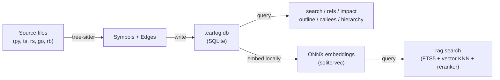

# cartog

[](https://github.com/jrollin/cartog/actions/workflows/ci.yml)
[](https://codecov.io/gh/jrollin/cartog)
[](https://crates.io/crates/cartog)
[](https://crates.io/crates/cartog)
[](https://github.com/jrollin/cartog)
[](LICENSE)

**Map your codebase. Navigate by graph, not grep.**

cartog gives your AI coding agent a pre-computed code graph — symbols, calls, imports, inheritance — so it queries structure in 1-2 calls instead of 6+. Everything runs locally: no API calls, no cloud, no data leaves your machine.

## Why cartog

| | grep/cat workflow | cartog |
|---|---|---|
| **Tokens per query** | ~1,700 | ~280 (**83% fewer**) |
| **Recall** (completeness) | 78% | 97% |
| **Query latency** | multi-step | 8-450 us |
| **Privacy** | n/a | **100% local** — no remote calls |
| **Transitive analysis** | impossible | `impact --depth 3` traces callers-of-callers |

Where cartog shines most: tracing call chains (88% token reduction, 35% grep recall vs 100% cartog), finding callers (95% reduction), and type references (93% reduction).

Measured across 13 scenarios, 5 languages ([full benchmark suite](benchmarks/)).

### What you get immediately

- **Single binary, self-contained** — `cargo install cartog` and you're done. No language server, no Docker, no config.
- **100% offline** — tree-sitter parsing + SQLite storage + ONNX embeddings. Your code never leaves your machine, ever.
- **Smart search routing** — keyword search (sub-ms, symbol names) and semantic search (natural language queries) work together. Run both in parallel when unsure.
- **Live index** — `cartog watch` auto re-indexes on file changes. Your agent always queries fresh data.
- **MCP server** — `cartog serve` exposes 11 tools over stdio. Plug into Claude Code, Cursor, Windsurf, Zed, or any MCP-compatible agent.


## Quick Start

```bash
cargo install cartog
cd your-project
cartog index .               # build the graph (~95ms for 4k LOC, incremental)
cartog search validate       # find symbols by name (sub-millisecond)
cartog refs validate_token   # who calls/imports/references this?
cartog impact validate_token # what breaks if I change this?
```

### Add semantic search (optional, still fully local)

```bash
cartog rag setup             # download embedding + re-ranker models (~50MB, one-time)
cartog rag index .           # embed all symbols into sqlite-vec
cartog rag search "authentication token validation"   # natural language queries
```

Models are downloaded once to `~/.cache/cartog/models/` and run locally via ONNX Runtime. No API keys, no network calls at query time.

## Install

### From crates.io

```bash
cargo install cartog
```

### Pre-built binaries

Download from [GitHub Releases](https://github.com/jrollin/cartog/releases/latest):

```bash
# macOS (Apple Silicon)
curl -L https://github.com/jrollin/cartog/releases/latest/download/cartog-aarch64-apple-darwin.tar.gz | tar xz
sudo mv cartog /usr/local/bin/

# macOS (Intel)
curl -L https://github.com/jrollin/cartog/releases/latest/download/cartog-x86_64-apple-darwin.tar.gz | tar xz
sudo mv cartog /usr/local/bin/

# Linux (x86_64)
curl -L https://github.com/jrollin/cartog/releases/latest/download/cartog-x86_64-unknown-linux-gnu.tar.gz | tar xz
sudo mv cartog /usr/local/bin/

# Linux (ARM64)
curl -L https://github.com/jrollin/cartog/releases/latest/download/cartog-aarch64-unknown-linux-gnu.tar.gz | tar xz
sudo mv cartog /usr/local/bin/

# Windows (x86_64) — download .zip from releases page
```

## Search: Keyword, Semantic, or Both

cartog offers two search modes that complement each other:

| Query type | Command | Speed | Best for |
|---|---|---|---|
| Symbol name / partial name | `cartog search parse` | sub-ms | You know the name: `validate_token`, `AuthService` |
| Natural language / concept | `cartog rag search "error handling"` | ~150-500ms | You know the behavior, not the name |
| Broad keyword, unsure | Run both in parallel | sub-ms + ~300ms | `auth`, `config` — catch names + semantics |

**Narrowing pattern**: `cartog search parse` returns 30 hits? Narrow with `cartog rag search "parse JSON response body"` to pinpoint the right ones.

```bash
# Direct keyword search — fast, exact
cartog search validate_token
cartog search parse --kind function --limit 10

# Semantic search — natural language, conceptual
cartog rag search "database connection pooling"
cartog rag search "error handling" --kind function

# Both in parallel when unsure
cartog search auth & cartog rag search "authentication and authorization"
```

## Commands

```bash
# Index
cartog index .                              # Build the graph (incremental)
cartog index . --force                      # Re-index all files

# Search
cartog search validate                      # Find symbols by partial name
cartog search validate --kind function      # Filter by kind
cartog rag search "token validation"        # Semantic search (natural language)

# Navigate
cartog outline src/auth/tokens.py           # File structure without reading it
cartog refs validate_token                  # Who references this? (calls, imports, inherits, types)
cartog refs validate_token --kind calls     # Filter: only call sites
cartog callees authenticate                 # What does this call?
cartog impact SessionManager --depth 3      # What breaks if I change this?
cartog hierarchy BaseService                # Inheritance tree
cartog deps src/routes/auth.py              # File-level imports
cartog stats                                # Index summary

# Watch (auto re-index on file changes)
cartog watch .                              # Watch for changes, re-index automatically
cartog watch . --rag                        # Also re-embed symbols (deferred)

# MCP Server
cartog serve                                # MCP server over stdio (11 tools)
cartog serve --watch                        # With background file watcher
cartog serve --watch --rag                  # Watcher + deferred RAG embedding
```

All commands support `--json` for structured output.

<details>
<summary><strong>Example outputs</strong></summary>

### outline

```
$ cartog outline auth/tokens.py
from datetime import datetime, timedelta  L3
from typing import Optional  L4
import hashlib  L5
class TokenError  L11-14
class ExpiredTokenError  L17-20
function generate_token(user: User, expires_in: int = 3600) -> str  L23-27
function validate_token(token: str) -> Optional[User]  L30-44
function lookup_session(token: str) -> Optional[Session]  L47-49
function refresh_token(old_token: str) -> str  L52-56
function revoke_token(token: str) -> bool  L59-65
```

### search

```
$ cartog search validate
function  validate_token    auth/tokens.py:30
function  validate_session  auth/tokens.py:68
function  validate_user     services/user.py:12
```

Results ranked: exact match > prefix > substring. Case-insensitive.

### impact

```
$ cartog impact validate_token --depth 3
  calls  get_current_user  auth/service.py:40
  calls  refresh_token  auth/tokens.py:54
    calls  impersonate  auth/service.py:52
```

### refs

```
$ cartog refs UserService
imports  ./service  routes/auth.py:3
calls    login  routes/auth.py:15
inherits AdminService  auth/service.py:47
references  process  routes/auth.py:22
```

</details>

## How It Works



1. **Index** — walks your project, parses each file with tree-sitter, extracts symbols (functions, classes, methods, imports, variables) and edges (calls, imports, inherits, raises, type references)
2. **Store** — writes everything to a local `.cartog.db` SQLite file
3. **Resolve** — links edges by name with scope-aware heuristic matching (same file > same directory > unique project match)
4. **Embed** (optional) — generates vector embeddings locally with ONNX Runtime (`BAAI/bge-small-en-v1.5`), stored in sqlite-vec
5. **Query** — instant lookups against the pre-computed graph, hybrid FTS5 + vector search with RRF merge and cross-encoder re-ranking

Re-indexing is incremental: only files with changed content hashes are re-parsed. `cartog watch` automates this on file changes.

**Everything runs on your machine.** No API keys. No cloud endpoints. No telemetry. Your code stays local.

## MCP Server

cartog runs as an [MCP](https://modelcontextprotocol.io/) server, exposing 11 tools (9 core + 2 RAG) over stdio.

```bash
# Claude Code
claude mcp add cartog -- cartog serve

# With live re-indexing
claude mcp add cartog -- cartog serve --watch --rag

# Cursor — add to .cursor/mcp.json
# Windsurf — add to ~/.codeium/windsurf/mcp_config.json
# OpenCode — add to .opencode.json
# Zed — add to ~/.config/zed/settings.json
```

Common config (JSON):

```json
{
  "mcpServers": {
    "cartog": {
      "command": "cartog",
      "args": ["serve", "--watch", "--rag"]
    }
  }
}
```

See [Usage — MCP Server](docs/usage.md#mcp-server) for per-client installation details.

## Agent Skill

Install cartog as an [Agent Skill](https://agentskills.io) for Claude Code, Cursor, Copilot, and other compatible agents:

```bash
npx skills add jrollin/cartog
```

Or install manually:

```bash
cp -r skills/cartog ~/.claude/skills/
```

The skill teaches your AI agent **when and how** to use cartog — including search routing (rag search as default, structural search for refs/callees/impact), refactoring workflows, and when to fall back to grep. See [Claude Code Integration](docs/claude-code.md) for details.

## Privacy

cartog is designed for air-gapped and privacy-conscious environments:

- **Parsing**: tree-sitter runs in-process, no external calls
- **Storage**: SQLite file in your project directory (`.cartog.db`)
- **Embeddings**: ONNX Runtime inference, models cached locally (`~/.cache/cartog/models/`)
- **Re-ranking**: cross-encoder runs locally via ONNX, no API
- **MCP server**: communicates over stdio only, no network sockets
- **No telemetry**, no analytics, no phone-home of any kind

Your code never leaves your machine. Not during indexing, not during search, not ever.

## Supported Languages

| Language | Extensions | Symbols | Edges |
|----------|-----------|---------|-------|
| Python | .py, .pyi | functions, classes, methods, imports, variables | calls, imports, inherits, raises, type refs |
| TypeScript | .ts, .tsx | functions, classes, methods, imports, variables | calls, imports, inherits, type refs, new |
| JavaScript | .js, .jsx, .mjs, .cjs | functions, classes, methods, imports, variables | calls, imports, inherits, new |
| Rust | .rs | functions, structs, traits, impls, imports | calls, imports, inherits (trait impl), type refs |
| Go | .go | functions, structs, interfaces, imports | calls, imports, type refs |
| Ruby | .rb | functions, classes, modules, imports | calls, imports, inherits, raises, rescue types |
| Java | — | *Planned* | — |

## Performance

Indexing: **69 files / 4k LOC in 95ms** (Python fixture, release build). Incremental re-index skips unchanged files.

Query latency (criterion benchmarks on the same fixture):

| Query type | Latency |
|-----------|---------|
| outline | 8-14 us |
| hierarchy | 8-9 us |
| deps | 25 us |
| stats | 32 us |
| search | 81-102 us |
| callees | 177-180 us |
| refs | 258-471 us |
| impact (depth 3) | 2.7-17 ms |

## Design Trade-offs

- **Structural, not semantic** — name-based resolution (~90% accuracy), not full type analysis. Good enough for navigation; LSP can be layered on later.
- **Self-contained** — single binary, all dependencies compiled in. No language server, no cloud service, no separate database process.
- **Incremental** — SHA256 hash per file, only re-indexes what changed.
- **Local-first** — embedding models run via ONNX Runtime on your CPU. Slower than API calls, but your code stays private.

## Documentation

- [Usage](docs/usage.md)
- [Claude Code Integration](docs/claude-code.md)
- [Product Overview](docs/product.md)
- [Technology Stack](docs/tech.md)
- [Project Structure](docs/structure.md)

## License

MIT
