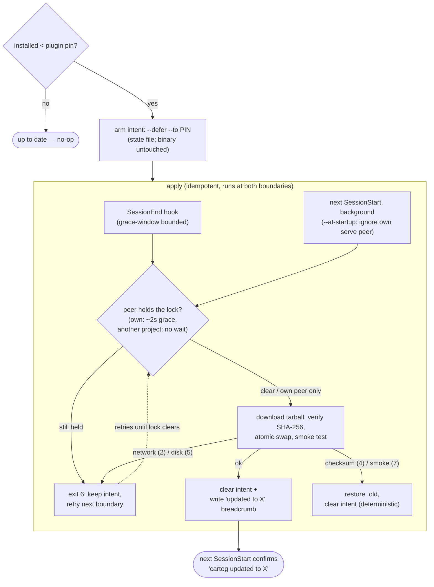

# How to Update cartog

> For exit codes, environment variables, and the state file format, see [../reference/exit-codes.md](../reference/exit-codes.md).
> Full reference: [../updates.md](../updates.md)

## Quick reference

| Command | What it does |
|---------|--------------|
| `cartog self update` | Upgrade in place to the latest stable release |
| `cartog self update --check` | Check whether an update exists; do nothing else |
| `cartog self update --defer` | Arm a deferred update (record the target, do **not** swap); succeeds even while a peer runs |
| `cartog self update --apply-pending` | Apply a previously-armed deferred update once no peer holds the lock |
| `cartog self version` | Print version, `describe` build string, target triple, install source, last check timestamp, pending update |
| `cartog self rollback` | Restore the previous binary (the `<bin>.old` sibling) |

## Upgrade in place

```bash
cartog self update
```

Downloads the matching tarball/zip for your platform, verifies its SHA256 against the release's `SHA256SUMS` asset, atomically swaps the binary in place, and runs a smoke test. The previous binary is preserved as a sibling `<bin>.old` for one rollback.

If a peer `cartog serve` or `cartog watch` is still running, the upgrade refuses (exit `6`) and names the live process so you can stop it first. PID files at the platform state directory (see below) are the detection mechanism.

### Output formats

```bash
cartog self update --check              # human-readable
cartog self update --check --json       # {"current":"…","latest":"…","outdated":bool}
cartog self update --check --quiet      # no output; exit code is the only signal
```

## Deferred update (in-session, advanced)

> Most users only need `cartog self update`. This section applies when cartog is
> running as a plugin MCP server (e.g. inside Claude Code) and the serve lock
> prevents an in-place swap.

Inside a Claude Code session the cartog plugin runs `cartog serve --watch` as the MCP server. That process holds the serve PID lock for the whole session, so a plain `cartog self update` would refuse (exit `6`) — you cannot swap the inode of a running binary. The deferred flow splits the decision from the swap:

1. **Arm** — `cartog self update --defer` records the target version in the state file and exits **without** touching the binary. It succeeds even while the serve peer is live (it deliberately skips the peer check). By default it arms the **latest stable** release; pass `--to <version>` to pin an exact target. Both `/cartog-install` and the `cartog_update` MCP tool arm the plugin's **pinned** version (`--to $PLUGIN_VERSION`, discovered from the plugin manifest) so a plugin-managed update can't overshoot the pin; they fall back to latest only outside a plugin install.
2. **Apply** — `cartog self update --apply-pending` reads the armed target, waits for any peer lock to clear, performs the real swap, and clears the intent. The wait is sized by what holds the lock: a lock this project owns gets a bounded grace (~2s) to absorb its own `serve` shutting down, while a lock held outside this project is not waited on at all, since it stays held for as long as that session stays open (waiting on it would only run a session hook out of time). The swap only proceeds when the armed target is **newer** than the installed binary — an armed target at or below the current version is a clean no-op (no downgrade). If a peer is still live after the wait (e.g. a second Claude Code window on the same project), it exits `6`, keeps the intent, and retries — the binary lands once the other session closes. Apply runs at **two** boundaries: the plugin's SessionEnd hook (after the serve process exits), and the **next SessionStart** as a catch-up. The SessionStart apply runs in the background pipeline, so it never blocks the session.
3. **Confirm** — the next SessionStart surfaces a one-line "cartog updated to X" breadcrumb, and the drift warning becomes "cartog X will be applied when this session ends" while an update is pending.

> **Why two apply points.** SessionEnd is bounded by Claude Code's teardown grace window; if the serve peer is slow to exit (SIGTERM → SIGKILL) the hook can be cancelled mid-download and the swap never lands. The SessionStart catch-up has no such deadline. But the new session's own `cartog serve --watch` takes the serve lock at startup and holds it all session, so the catch-up runs `--apply-pending --at-startup`, which **excludes this project's own serve/watch peer** from the peer-wait — the atomic same-FS swap is safe under a live same-project peer (it keeps its file descriptor on the old inode until it re-execs). A serve peer from **another** project still blocks (exit `6`, retry). On Windows, `--at-startup` is a no-op (a running `.exe` cannot be renamed while a peer holds it), so there the swap still waits for the same-project peer to exit. The apply is idempotent (`decide_apply` skips when already at/past the target) and self-clearing, so running at both boundaries is safe.

The tarball is fetched at **apply** time, keyed to the armed target — not at arm time.

```bash
cartog self update --defer                 # arm the latest stable release, no swap (exit 0 even with a peer)
cartog self update --defer --to 0.20.0     # arm an exact pinned version instead of latest
cartog self update --defer --json          # {"status":"armed","current":…,"target":…,"apply":"session-end-or-restart"}
cartog self update --apply-pending          # apply the armed update once no peer holds the lock
cartog self update --apply-pending --at-startup  # as above, but ignore THIS project's own serve peer (SessionStart use)
```

### Flow



The two apply boundaries are the key to convergence: a SessionEnd apply cancelled by teardown is retried at the next SessionStart, where `--at-startup` lets it land despite the session's own serve peer.

### Plugin version bumps (new and existing users)

When a new plugin version ships, here is what each cohort experiences:

- **New user** — `cartog serve` can't start the first session (no binary yet); the SessionStart hook forks `install.sh` pinned to the plugin version (downloads the release tarball, **verifies its SHA-256**, installs). cartog tools are live from the **next** session. `/cartog-install` installs synchronously if you don't want to wait.
- **Existing user, passive, `>= 0.20`** — at SessionEnd the hook auto-arms the pinned version on drift (`--defer --to $PLUGIN_VERSION`) and applies it once the serve lock clears; if that apply is cancelled by session teardown, the next SessionStart applies it as a background catch-up. Either way the next SessionStart confirms "cartog updated to X". No manual action required.
- **Existing user, active** — running `/cartog-install` (or the `cartog_update` tool) mid-session arms the pin immediately; it lands at the same SessionEnd boundary.
- **Existing user, `0.14`–`0.20`** — these binaries have `cartog self update` but predate the deferred flags (`--defer`/`--apply-pending` landed in 0.20.0). The SessionEnd hook probes capability and converges them via the bundled `install.sh` pinned to `$PLUGIN_VERSION` — the same pin-exact path as the legacy cohort. (A plain `cartog self update` would fetch the **latest** release, overshooting the pin with no `--to` to constrain it on those versions.) Without this, firing the deferred flags at them errored with clap exit `2` and looped forever as a false "transient" failure.
- **cargo-installed user** — `cartog self update` refuses (exit `3`) because it must not clobber a cargo-managed binary. The SessionStart drift line and the SessionEnd breadcrumb both tell this cohort to run `cargo install cartog --force` (not `/cartog-install`).
- **Legacy `<0.14` user** — auto-upgraded at SessionEnd via `install.sh` (that cohort predates `cartog self update`).

Notes and edge cases:

- **Confirmation latency** — for the armed/active path the full loop spans two session boundaries (arm this session → apply at SessionEnd → confirm next SessionStart). There is no mid-session confirmation; SessionEnd hook output goes to the session log, not the chat.
- **Multi-window** — a second Claude Code window holding the serve lock defers the apply (exit `6`, intent kept) until that window closes; the SessionStart drift line says so.
- **Release timing** — `release.sh` pushes the version bump and tag before the release workflow finishes building the tarballs. In the few-minute build window the pinned tarball can 404; armed paths self-heal (network failure keeps the intent and retries next session), and the marketplace only serves new plugin files to users after the build completes in practice.
- **A broken release** — a checksum (`4`) or smoke-test (`7`) failure clears the intent, restores the previous binary, and surfaces an actionable message rather than retry-looping. If a swap is interrupted (e.g. SIGKILL mid-rename), the previous binary is preserved at `<bin>.old` — recover with `cartog self rollback`.

## Troubleshooting

Update failures map to the exit codes in [../reference/exit-codes.md](../reference/exit-codes.md). For peer-lock refusals ("another
cartog process is running"), stale PID files, checksum mismatches, and
`cargo install` users, see [../troubleshooting.md](../troubleshooting.md).
